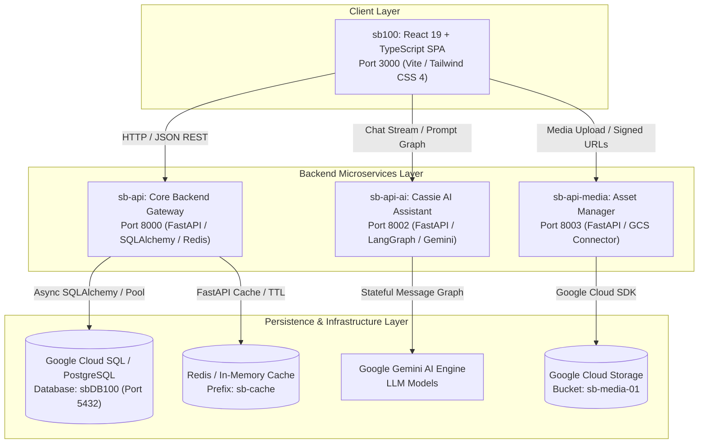
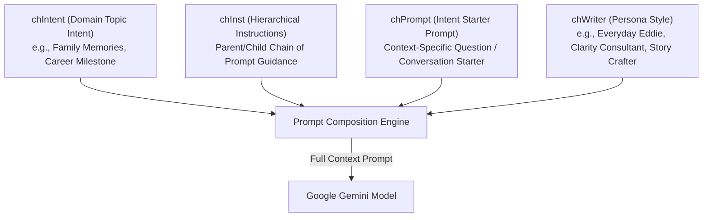
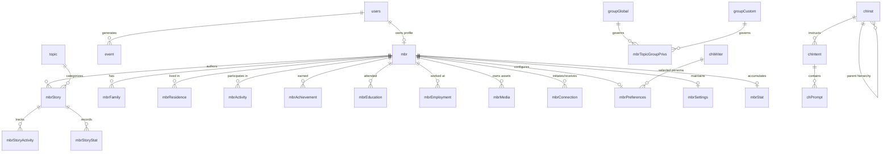

# StoryBook Application — Comprehensive Technical Specifications

**Version:** 1.0.0  
**Target Environment:** Node.js 20+, Python 3.11+, PostgreSQL 15+, Google Cloud Platform (Cloud SQL, Cloud Storage, Vertex AI/Gemini)  
**Architecture Style:** Microservices Ecosystem (SPA Frontend + RESTful Micro-APIs + LangGraph AI Engine + Cloud Storage + Cloud SQL)

---

## 1. System Architecture Overview

The **StoryBook** ecosystem is a multi-tier, AI-assisted digital memoir and family legacy platform. It empowers members to record, author, preserve, organize, and privately share personal life chapters, memories, photos, and milestones with granular privacy controls and AI co-writing assistance.



---

## 2. Microservice Topology & Port Allocations

| Service Name | Working Directory | Runtime / Framework | Default Port | Health Check Endpoint | Primary Responsibility |
| :--- | :--- | :--- | :--- | :--- | :--- |
| **`sb100`** | `sbook/sb100` | React 19, Vite 6, TypeScript 5.8 | `3000` | `http://127.0.0.1:3000` | Responsive Frontend Single-Page Application (SPA) |
| **`sb-api`** | `sbook/sb-api` | Python 3.11+, FastAPI, SQLAlchemy | `8000` | `http://127.0.0.1:8000/health` | Core CRUD operations, authentication, relations, system config |
| **`sb-api-ai`** | `sbook/sb-api-ai` | Python 3.11+, FastAPI, LangGraph | `8002` | `http://127.0.0.1:8002/health` | Cassie AI StoryMate interactive co-writer & prompt generation |
| **`sb-api-media`**| `sbook/sb-api-media`| Python 3.11+, FastAPI, Google Cloud SDK | `8003` | `http://127.0.0.1:8003/health` | Cloud bucket asset management, file streaming, signed URLs |
| **`sb-dbs`** | `sbook/sb-dbs` | PostgreSQL 15+ (Cloud SQL) | `5432` | N/A (Direct DB Engine) | Relational database schema DDLs, migrations, and seed scripts |

---

## 3. Frontend Architecture (`sb100`)

### 3.1 Technology Stack
- **Core Framework:** React 19 (`react`, `react-dom`), TypeScript 5.8
- **Build Tool:** Vite 6 with `@vitejs/plugin-react` and `@tailwindcss/vite`
- **Styling:** Tailwind CSS v4, custom CSS variables supporting dynamic theme injection (`Default`, `Sepia`, `Vintage`, `Slate`, `Emerald`, `Midnight`)
- **Animation & Motion:** `motion` (Framer Motion v12) for view transitions and micro-interactions
- **Iconography:** `lucide-react`
- **Document Export:** `jspdf`, `jspdf-autotable` for memoir and printable story exports

### 3.2 Dual Mode Operational Model
The frontend supports an immediate toggle between **Live Backend Mode** and **Sandbox Offline Mode**:
1. **Live Mode:** Queries `sb-api`, `sb-api-ai`, and `sb-api-media` endpoints via `fetch` API client (`@/src/services/api.ts`).
2. **Sandbox Mode:** Executes localized, memory/sessionStorage-backed data flows with complete offline mocks (`SANDBOX_USERS`, `sandbox_mbr`, `sandbox_stories`, `sandbox_mbr_preferences`), enabling full UI testing without external database dependencies.

### 3.3 Application Feature Modules
The frontend is organized under `src/features/` with isolated domain boundaries:

```
src/features/
├── publicPage/               # Unauthenticated public showcase, hero carousel, community stats
├── mbrHomePage/              # Authenticated member home dashboard, status cards, recent connections
├── mbrAuthorPage/            # Story editor, StoryMate Cassie AI panel, topic navigation
├── mbrStoryPage/             # Story reader, multi-chapter memoir viewer, table of contents
├── mbrProfilePage/           # Profile bio, avatar management, structured history panels
├── mbrConnectionPage/        # Member invitation management, connection grouping, proximity search
├── mbrPreferencesPage/       # Theme selection, notification preferences, writing persona setup
├── mbrPrivacySettingsPage/   # Topic-to-Group privacy matrix, custom access controls
├── mbrLogonPage/             # Email/Password & Social OAuth login flows
├── mbrRegistrationPage/      # Multi-step member onboarding and profile creation
├── adminUserAdminPage/       # User administration, account lookup, switch-user impersonation
├── adminConnectionsPage/     # Global connection relationship administrative tooling
├── adminDbPage/              # Dynamic database table explorer and raw record inspector
├── adminCachePage/           # Redis/In-memory cache monitoring and eviction controls
├── adminMediaPage/           # Cloud Storage bucket browser, file upload and deletion
└── adminProperties/          # System configuration property manager (sysConfig)
```

### 3.4 Global Layout & Session Infrastructure
- **`MainLayout.tsx`:** Universal responsive scaffold containing global header, navigation menu, notification counters, theme provider, and dynamic user dropdown.
- **Session Timeout Watchdog (`useSessionTimeout`):** Tracks user activity across DOM events (`mousemove`, `keydown`, `touchstart`, `scroll`) and presents a proactive renewal modal before expiring sessions after 30 minutes of inactivity.
- **Dynamic Component Tagging (`AdminComponentTag` & `useShowComponentName`):** Subscribes to the runtime `SHOW_COMPONENT_NAME` system setting. When enabled, renders discreet floating badges indicating the React component name and active AI Prompt/Intent/Instruction metadata.

---

## 4. Core Backend API Specification (`sb-api`)

### 4.1 Technology Stack
- **Framework:** FastAPI 0.110+ (ASGI / Uvicorn)
- **ORM / Database:** SQLAlchemy 2.0 with connection pooling and Google Cloud SQL Python Connector (`cloud-sql-python-connector[pg8000]`)
- **Caching:** `fastapi-cache2` with dual-backend support:
  - Primary: Redis (`aioredis` / `redis-py`)
  - Fallback: High-speed in-memory LRU cache
- **Logging Subsystem (`LogManager`):** Asynchronous, non-blocking log ingestion engine utilizing queue-backed workers flushing execution traces directly to database `event` tables.
- **Dynamic Configuration Subsystem (`DynamicConfigManager`):** Automatically bootstraps missing system parameters from schema blueprints into `sysConfig` and provides in-process runtime caching with sub-millisecond lookups.

### 4.2 REST Router Catalog (30+ Endpoints)

| Router Prefix | Primary Operations | Key Models / Entities |
| :--- | :--- | :--- |
| `/users` | User registration, authentication, UUID lookup, password hash verification | `User` |
| `/mbr` | Member bio, contact info, geocoding coords, profile picture resolution | `Mbr` |
| `/mbr/stories` | Story chapters, markdown content, drafts, publication dates, subordinate chapters | `MbrStory`, `MbrStoryActivity`, `MbrStoryStat` |
| `/mbr/family` | Family members, relationships, generational lineages, life milestones | `MbrFamily` |
| `/mbr/residences`| Living places, addresses, geocoded coordinates, historical residences | `MbrResidence` |
| `/mbr/activities`| Pastimes, hobbies, sports, creative projects | `MbrActivity` |
| `/mbr/achievements`| Awards, milestones, recognitions, proud moments | `MbrAchievement` |
| `/mbr/education` | Academic history, degrees, institutions, mentor memories | `MbrEducation` |
| `/mbr/employment`| Careers, first jobs, companies, professional accomplishments | `MbrEmployment` |
| `/mbr/connections`| Connection requests, acceptance workflows, grouping assignments | `MbrConnection`, `MbrConnectionGrp` |
| `/mbr/privacy` | Granular story/topic visibility matrix across connection groups | `MbrTopicGroupPrivs` |
| `/mbr/preferences`| User themes, notification settings, selected writer persona ID | `MbrPreferences`, `MbrSettings` |
| `/sysconfig` | System property CRUD, real-time dynamic flags (`SHOW_COMPONENT_NAME`, etc.) | `SysConfig` |
| `/admin/cache` | Cache statistics, key listings, granular or full cache eviction | `AdminCache` |
| `/events` | Audit logging, system events, access logs | `Event` |

### 4.3 Geocoding & Proximity Search
- **Haversine Distance Engine:** Computes spherical surface distances between member latitude/longitude coordinates to power geographical neighbor discovery and proximity searches within customizable radii (10–500 miles).
- **Geocoding Service:** Integrates forward and reverse geocoding to automatically resolve city, state, postal code, and country strings into geographic latitude and longitude.

---

## 5. AI Co-Writer Service Specification (`sb-api-ai`)

### 5.1 Architecture & Workflow
- **Framework:** FastAPI with LangGraph stateful graph execution.
- **AI Models:** Google Gemini 2.5 / 3.x Flash via LangChain Google GenAI integration.
- **Stateful Threads:** Conversations persist across user sessions via `thread_id` keys (`thread_<random_hash>`), allowing members to iteratively draft and refine stories across repeat visits.

### 5.2 Hierarchical Prompt Engineering System
The AI co-writing engine dynamically composes LLM system prompts using a three-tier database-driven hierarchy:



1. **`chIntent` (Intent Definition):** Defines the active domain focus (e.g., `sbMbrStryFamly`, `sbMbrStryResidence`, `sbMbrStryEducation`).
2. **`chInst` (Hierarchical Instructions):** Relational instructions linked in a parent-child chain (`chInstParentId`). The backend recursively concatenates parent rules with specialized child guidelines.
3. **`chPrompt` (Conversation Starters):** Versioned prompt starters triggered by the Cassie AI character upon opening any topic editor.
4. **`chWriter` (Writing Persona Modes):**
   - **Everyday Eddie:** Conversational, friendly, accessible, informal.
   - **Clarity Consultant:** Professional, structured, precise, neutral.
   - **Casual Chuckles:** Playful, humorous, witty analogies.
   - **The Polished Guide:** Warm, supportive, encouraging, professional.
   - **The Story Crafter:** Narrative, rich sensory detail, descriptive, literary.

---

## 6. Media Asset Service Specification (`sb-api-media`)

### 6.1 Technology Stack & Cloud Storage
- **Framework:** FastAPI with Google Cloud Storage SDK (`google-cloud-storage`).
- **Target Bucket:** `sb-media-01`
- **File Types Supported:** JPEG, PNG, WebP, GIF, SVG, PDF, MP4, WebM.

### 6.2 Capabilities
1. **Direct Streaming & Proxying:** Streams media objects securely without exposing raw bucket credentials.
2. **Signed URLs:** Generates time-limited (1–1440 minutes) `GET` and `PUT` signed URLs for client-side direct uploads and private viewing.
3. **Thumbnail Generation & Optimization:** Resizes and delivers web-optimized image assets.
4. **Bucket Health & Diagnostics:** Proactive health check querying bucket metadata and read/write access permissions.

---

## 7. Database Relational Model (`sb-dbs` / `sbDB100`)

### 7.1 Entity Relationship Diagram



### 7.2 Core Relational Table Catalog

| Table Name | Primary Key | Foreign Keys | Purpose / Description |
| :--- | :--- | :--- | :--- |
| **`users`** | `user_id` (UUID) | None | System user authentication credentials, email, password hash, active status |
| **`mbr`** | `mbrId` (UUID) | `userId` -> `users` | Core member profile, names, bio, avatar pic URL, latitude, longitude, location |
| **`mbrStory`** | `mbrStoryId` (UUID) | `mbrId` -> `mbr`, `topicId` -> `topic` | Story chapters, drafts, markdown content, publication status, subordinate chapters |
| **`mbrFamily`** | `mbrFamilyId` (UUID) | `mbrId` -> `mbr` | Structured records of relatives, birthdates, relationships, family stories |
| **`mbrResidence`**| `mbrResidenceId` (UUID)| `mbrId` -> `mbr` | Past addresses, homes, cities, states, geocodes, sensory memories |
| **`mbrActivity`** | `mbrActivityId` (UUID) | `mbrId` -> `mbr` | Hobbies, pastimes, sports, creative projects |
| **`mbrAchievement`**| `mbrAchievementId` (UUID)| `mbrId` -> `mbr` | Awards, honors, certifications, milestone life achievements |
| **`mbrEducation`**| `mbrEducationId` (UUID)| `mbrId` -> `mbr` | Schools, colleges, degrees, graduation years, mentors |
| **`mbrEmployment`**| `mbrEmploymentId` (UUID)| `mbrId` -> `mbr` | Jobs, employers, roles, career milestones, lessons |
| **`mbrMedia`** | `mbrMediaId` (UUID) | `mbrId` -> `mbr` | Member media assets, image URLs, captions, upload timestamps |
| **`mbrConnection`**| `mbrConnectionId` (UUID)| `mbrId`, `mbrTargetId` -> `mbr` | Social graph connection relationships, status (pending, accepted, blocked) |
| **`mbrConnectionGrp`**| `mbrConnectionGrpId`| `mbrId` -> `mbr` | Member-specific connection grouping categories (Close Family, Friends, etc.) |
| **`mbrTopicGroupPrivs`**| `privId` (UUID) | `mbrId`, `topicId`, `groupId` | Topic-level access control matrix defining which connection groups see which topics |
| **`mbrPreferences`**| `mbrPrefId` (UUID) | `mbrId` -> `mbr`, `chWriterId` | UI theme preference, email alerts, selected AI writing persona |
| **`mbrSettings`** | `mbrSettingsId` (UUID)| `mbrId` -> `mbr` | System account settings, display flags, session settings |
| **`mbrStat`** | `mbrStatId` (UUID) | `mbrId` -> `mbr` | Aggregated member analytics: total stories, published words, connection count |
| **`topic`** | `topicId` (VARCHAR) | None | System story topics (Family, Career, Travel, Childhood, etc.) with sort order |
| **`groupGlobal`** | `grpId` (VARCHAR) | None | System-wide global connection tiers (Public, Members, Family, Close Friends) |
| **`groupCustom`** | `grpId` (UUID) | `mbrId` -> `mbr` | Custom user-defined relationship circles |
| **`chIntent`** | `chIntentId` (UUID) | `chInstId` -> `chInst` | AI intent categories mapping topics to prompt strategies |
| **`chInst`** | `chInstId` (UUID) | `chInstParentId` -> `chInst` | Hierarchical AI prompt instructions with recursive inheritance |
| **`chPrompt`** | `chPromptId` (UUID) | `chIntentId` -> `chIntent` | Versioned conversation starters and prompt templates |
| **`chWriter`** | `chWriterId` (VARCHAR)| None | Predefined author personas and stylistic LLM instructions |
| **`sysConfig`** | `configId` (UUID) | None | Dynamic system configuration properties (`SHOW_COMPONENT_NAME`, etc.) |
| **`cd`** | `cdId` (UUID) | None | System code lookup dictionary tables |
| **`event`** | `eventId` (UUID) | `userId` -> `users` | Non-blocking audit log of system events, logins, and modifications |

---

## 8. Security & Data Protection Architecture

1. **Authentication & Session Tokens:**
   - Password hashing with salt algorithms.
   - Client session tokens stored in browser `sessionStorage` and automatically cleansed upon logout or session timeout.
2. **Access Control & Privacy Matrix:**
   - Evaluates topic-level permissions against the requesting member's assigned connection group (`mbrTopicGroupPrivs`) before serving story payloads.
3. **CORS & Network Boundaries:**
   - Explicit CORS policy configured across all FastAPI microservices allowing secure API consumption from authorized web clients.
4. **Cloud Database Isolation:**
   - PostgreSQL runs within Google Cloud SQL with TLS encrypted transit, connection pooling, and credential separation via environment variables.

---

## 9. Operations, Scripts & Development Workflows

### 9.1 Ecosystem Management Scripts
All ecosystem scripts are located in `sb100/scripts/`:

- **`start_all_services.ps1`:** Concurrently initiates all 4 services (`sb-api` on 8000, `sb-api-ai` on 8002, `sb-api-media` on 8003, `sb100` on 3000) and runs sub-second parallel health polling until all endpoints report `[OK]`.
- **`stop_all_services.ps1`:** Cleanly terminates all processes bound to ports 8000, 8002, 8003, and 3000.
- **`check_health.ps1`:** Performs non-intrusive parallel health checks against all 4 services and prints structured diagnostic status reports.

### 9.2 Build & Verification Commands
```powershell
# Run frontend dev server
cd sb100
npm run dev

# Run frontend production build & typecheck
npm run build

# Start all microservices in background
powershell -ExecutionPolicy Bypass -File .\scripts\start_all_services.ps1

# Run health checks
powershell -ExecutionPolicy Bypass -File .\scripts\check_health.ps1
```
